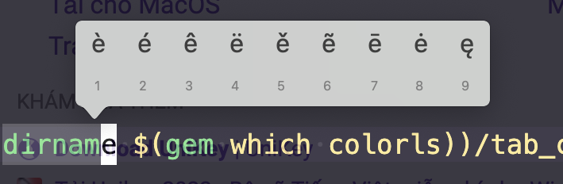

# **Fix-issues**
## **1. Issue:** 
- When pressing and holding "e" or "a, k, .." key then the table below will appear.
    ||
    |-|
  - #### ***Fix issue:*** Source of [*code*.](https://en.ihowto.tips/osx-apps-download-tutorials-tips-hacks-news/cum-activam-repetarea-caracterelor-cand-tinem-apasata-o-tasta-pe-macos-press-hold-key.html#:~:text=How%20to%20activate%20character%20repeat%20when%20you%20hold,normally%20would%20have%20had%20special%20characters%20behind%20it)
	```sh
	defaults write -g ApplePressAndHoldEnabled -bool false
	```

## **2. Issue:** 
- Can't press double-space.
  - #### ***Fix issue***
	||
    |-|

<!-- [](https://youtu.be/XFUIxUSpxoA) -->

